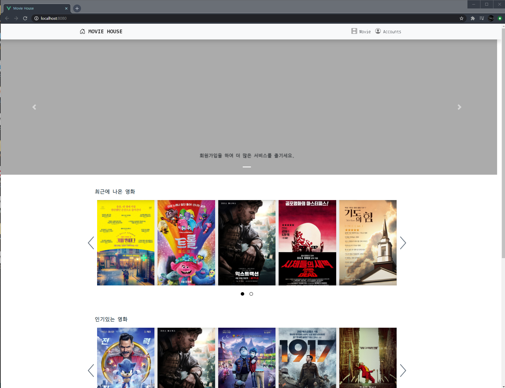
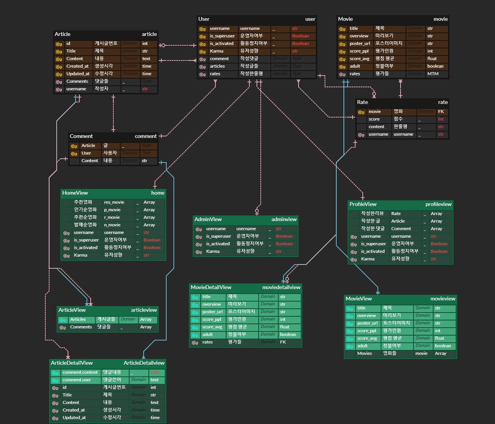
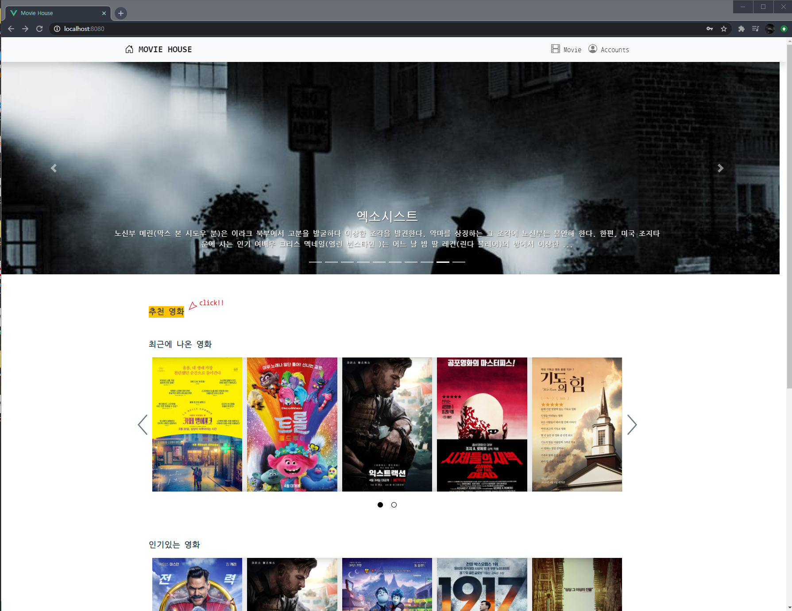
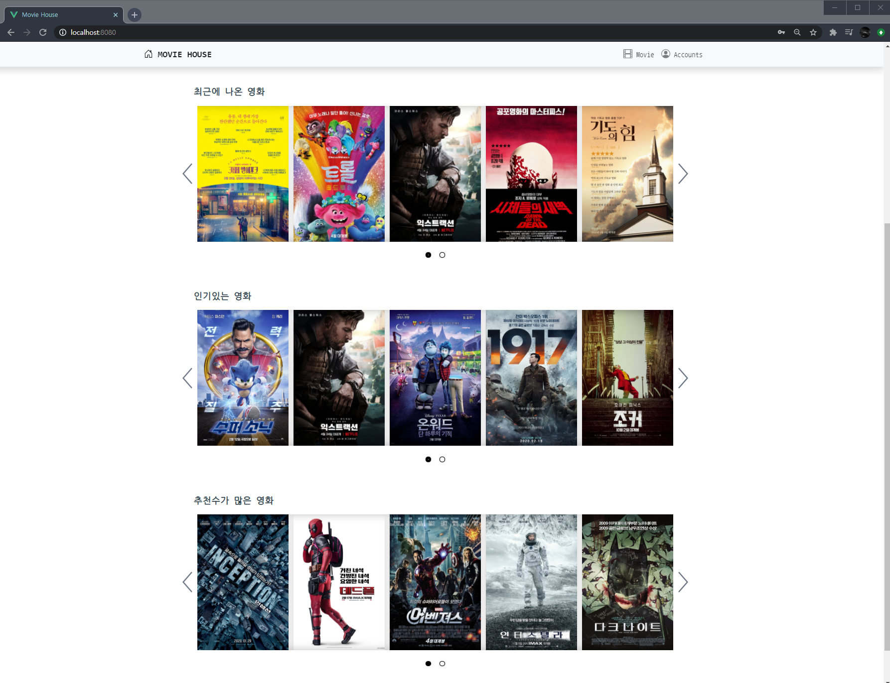
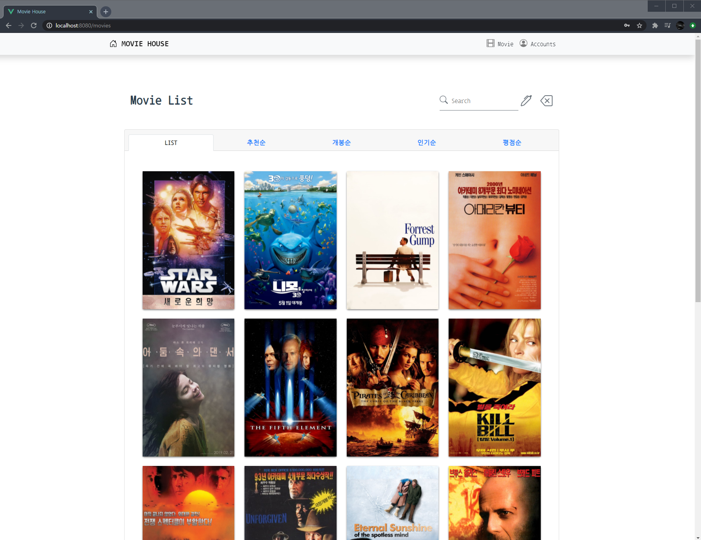
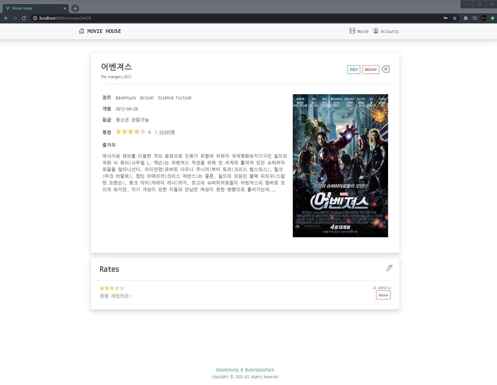
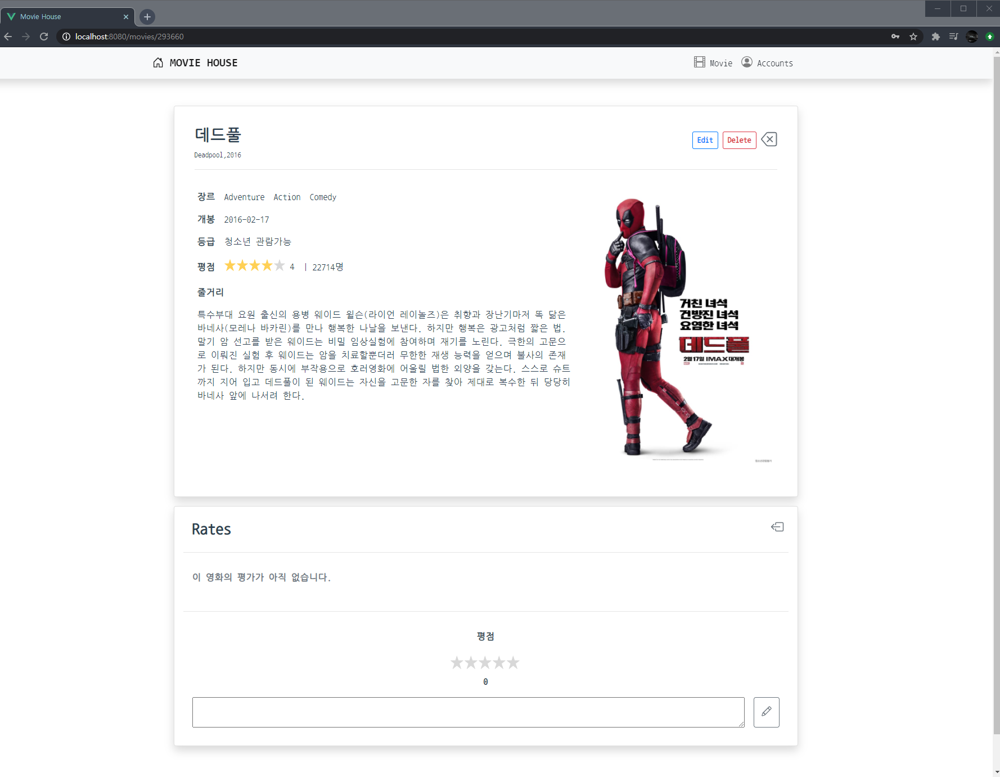
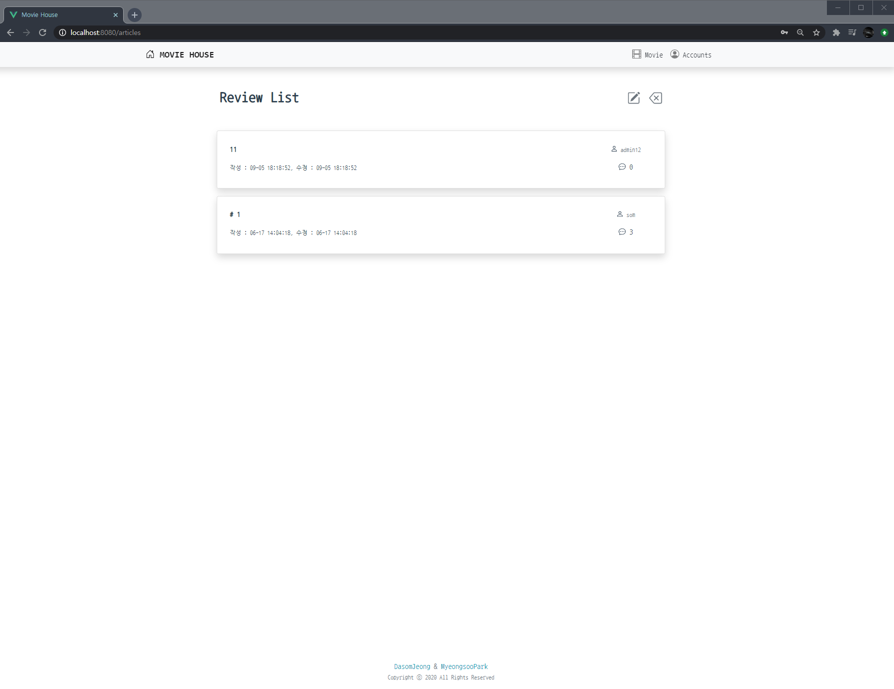
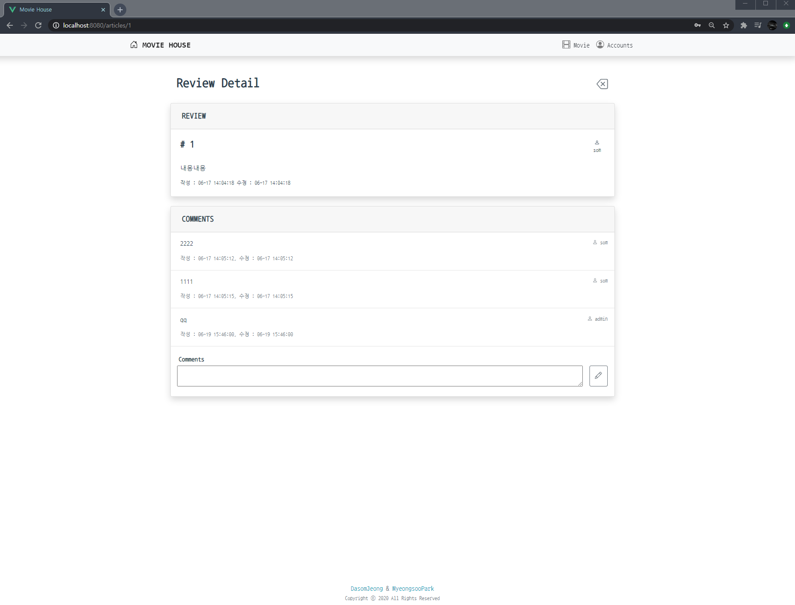

# 🎥 MOVIE HOUSE

<hr>




### 📋 프로젝트 정보

* 팀장 : 정다솜
* 팀원 : 박명수
* 프로젝트 : 평점 기반 영화 추천 사이트
* 기간 : 2020.06.11 ~ 2020.06.18


### 1️⃣ 팀원 정보 및 역할 분담

| 팀원   | 역할           | 비고                                                      |
| ------ | -------------- | --------------------------------------------------------- |
| 정다솜 | 팀장, FrontEnd | 화면 설계 및 디자인, Vue.js 로직 구현 및 핵심적인 UI 구현 |
| 박명수 | BackEnd        | Django API Server, Data Seeding 구현                      |


### 2️⃣ 목표 서비스 구현 및 실제 구현 정도

#### 목표 서비스

* 영화 정보 기반 추천 서비스 구성

* 커뮤니티 서비스 구성

* HTML, CSS, JavaScript, Vue.js, Django, REST API, DataBase 등을 활용한 실제 서비스 설계

* 서비스 배포 및 관리

  

#### 실제 구현도

* Vue.js 와 Django를 활용한 서비스 설계
* 영화 정보 기반 추천 서비스, 커뮤니티 서비스 구성
* HTML, CSS, JS을 활용한 화면 설계 및 디자인
* AWS , Ubunta를 활용한 서비스 배포


### 3️⃣ 프로젝트 과정

| 날짜     | 과정                                                         |
| -------- | ------------------------------------------------------------ |
| 20.06.11 | 프로젝트 계획 수립 및 명세 기반으로 기본적인 사이트 틀 작업  |
| 20.06.12 | Data Seeding, Accounts와 Movie 기능 구현, Accounts 화면 설계 및 디자인(sign up, login, logout) |
| 20.06.13 | Movie 화면 설계 및 디자인, Accounts 기능 추가 및 화면 설계(Profile, admin) |
| 20.06.15 | Community 기능 구현, Community 화면 설계 및 디자인(리뷰, 댓글 조회/생성/수정/삭제) |
| 20.06.16 | Movie 기능 추가 및 화면 설계(추천 알고리즘, 평점 등록), Accounts 추가 기능 구현(성향) |
| 20.06.17 | Movie 기능 추가 및 화면 설계(Pagination, 기준별 조회), UCC와 PPT 작업 |
| 20.06.18 | 오류 수정 및 디자인 추가 작업, 배포 시도..                   |


### 4️⃣ 개발 환경

##### Frontend (Vue.js)

- axios : 0.19.2

- bootstrap : 4.5.0

- bootstrap-vue : 2.15.0

- vue : 2.6.11

- vue-cookies : 1.7.0

- vue-router : 3.3.2

- vue-star : 0.0.4

  

##### Backend (Django REST API 서버)

- Django : 2.1.12

- Django REST framework : 3.11.0

- Python : 3.7.4

  

##### 서비스 배포 환경

Ubuntu / Amazon Linux 


### 5️⃣ 프로젝트 폴더 구조

```sh
│ 
│  README.md
│
├─movie_backend
│  │  db.sqlite3
│  │  manage.py
│  │  moviedata.json
│  │  requirements.txt
│  │  
│  ├─accounts
│  │  │  admin.py
│  │  │  apps.py
│  │  │  models.py
│  │  │  serializers.py
│  │  │  tests.py
│  │  │  urls.py
│  │  │  views.py
│  │  │  __init__.py
│  │  │  
│  │  └─migrations
│  │        
│  ├─articles
│  │  │  admin.py
│  │  │  apps.py
│  │  │  models.py
│  │  │  serializers.py
│  │  │  tests.py
│  │  │  urls.py
│  │  │  views.py
│  │  │  __init__.py
│  │  │  
│  │  └─migrations
│  │
│  ├─movies
│  │  │  admin.py
│  │  │  apps.py
│  │  │  models.py
│  │  │  serializers.py
│  │  │  tests.py
│  │  │  urls.py
│  │  │  views.py
│  │  │  __init__.py
│  │  │  
│  │  └─migrations
│  │          
│  ├─movie_backend
│  │  │  settings.py
│  │  │  urls.py
│  │  │  wsgi.py
│  │  └─ __init__.py
│  │          
│  └─venv
│
│                  
└─movie_frontend
    │  babel.config.js
    │  package-lock.json
    │  package.json
    │  
    ├─node_modules
    │
    ├─public
    │      favicon.ico
    │      index.html
    │      
    └─src
        │  App.vue
        │  main.js
        ├─router
        │      index.js
        │      
        └─views
            │  Home.vue
            │  
            ├─accounts
            │      AdminView.vue
            │      LoginView.vue
            │      ProfileView.vue
            │      SignupView.vue
            │      TestView.vue
            │      
            ├─articles
            │      ArticleCreateView.vue
            │      ArticleDetailView.vue
            │      ArticleListView.vue
            │      ArticleModifyView.vue
            │      CommentCreate.vue
            │      
            └─movies
                    MovieCommentCreate.vue
                    MovieCreateView.vue
                    MovieDetailView.vue
                    MovieListView.vue
                    MovieModifyView.vue
```


### :six: ERD




### :seven: 기능

#### Accounts

- 유저 프로필 화면
- 관리자 권한으로 유저 관리
- 등록한 리뷰, 평점을 기반으로 자신의 성향 파악 가능
- 자신이 작성한 평점과 리뷰 확인


#### Movie

* 추천 알고리즘을 통해 기본적인 영화 추천 가능
* 등록한 평점을 기반으로 새로운 영화 추천 알고리즘 구현
* 검색 기능을 통해 바로 원하는 영화에 접근 가능
* 원하는 기준으로 영화 목록을 볼 수 있음


#### Community

* 회원은 평점, 리뷰 등록 가능

* 자신의 리뷰에서 댓글을 통해 다른 유저들과 소통 가능

  


### :eight:  UI/UX

:pushpin: 로그인 시, 평점을 작성한 유저는 추천영화 버튼을 통해 Carousel 형태로 추천 영화를 확인해 보세요.




:pushpin: 영화 추천 알고리즘은 **개봉순**, **인기순**, **추천순**으로, Carousel형태를 통해 확인해 보세요!




:pushpin: 영화 추천 알고리즘을 통해 각 알고리즘별 리스트를 확인할 수 있습니다.




:pushpin: 영화 상세정보와 평점을 확인하고 평점을 남겨 실시간으로 변하는 평점을 통해 새로운 추천 영화들을 확인해 보세요!






:pushpin: 리뷰를 남길 수 있고, 커뮤니티를 통해 사람들과 함께 소통해 보세요!






### :nine: 느낀점

* 처음으로 1주일이라는 기간을 가지고 팀프로젝트를 진행했습니다. 저는 프론트엔드부분을 위주로 작업을 하게 되었는데, Vue를 쓸 때 컴포넌트를 구성하고 작업하는 것에 있어서 많은 어려움이 느껴졌습니다. 생각보다 많은 시간을 vue에서 쓰게 되어 디자인, ucc부분에 있어서 아쉬움이 크고, 좀 더 다양한 기능을 구현하지 못한 것이 아쉬웠습니다. 이 프로젝트를 통해서 백엔드 부분과 프론트 엔드 부분 모두 가능한 풀스택 개발자가 되고 싶다고 느꼈고, 이것을 시작으로 다양한 프로젝트를 진행해 보고 싶다는 생각이 들었습니다.

